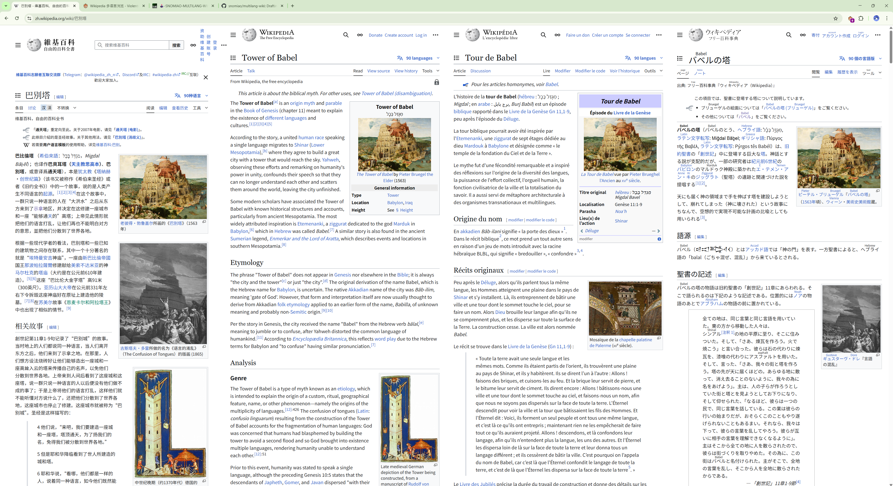

# Wikipedia Multi Language View


A userscript that allows you to view Wikipedia articles in multiple languages side by side. Perfect for language learning and comparative reading.

## Features

- **Side-by-side View**: Display Wikipedia articles in two languages simultaneously
- **Synchronized Scrolling**: Both language views maintain their relative positions
- **Customizable Languages**: Easily configure your preferred languages
- **Seamless Integration**: Works directly on Wikipedia without external dependencies
- **Cross-language Navigation**: Clicking links in either view keeps the dual-language experience

## Screenshots



## Installation

1. Install a userscript manager extension for your browser:
   - [Tampermonkey](https://www.tampermonkey.net/) (recommended)
   - [Greasemonkey](https://www.greasespot.net/)
   - [Violentmonkey](https://violentmonkey.github.io/)

2. Install this userscript by clicking on the following link:
   - [Install Wikipedia Multi Language View](https://github.com/snomiao/multilang-wiki/raw/main/multilang-wiki.user.js)

3. Confirm the installation when prompted by your userscript manager

## Usage

1. Navigate to any Wikipedia article
2. The script will automatically load a second language view on the right side
3. By default, it tries to load English, Japanese, or Chinese as the second language
4. You can customize your preferred languages by editing the userscript

### Customizing Languages

To change which languages are displayed as the second view:

1. Open your userscript manager
2. Edit the Wikipedia Multi Language View script
3. Find this line:
   ```javascript
   const langs = ["en", "ja", "zh"]; // modify this to your preferred languages
   ```
4. Change the language codes to your preferred languages (in order of preference)
5. Save your changes

Available language codes include: 'en', 'ja', 'zh', 'de', 'fr', 'es', 'ru', 'it', 'ko', 'pt', 'ar', 'vi', 'pl', 'uk', 'nl', 'sv', 'id', 'fi', 'no', and many more.

## How It Works

The script:

1. Detects available language versions of the current Wikipedia article
2. Creates a split-screen view with the current article on the left
3. Loads the article in your preferred second language on the right
4. Handles cross-frame communication for scrolling synchronization
5. Ensures links open in the parent window to maintain the dual-view

## Contributing

Contributions are welcome! Please feel free to submit a Pull Request.

1. Fork the repository
2. Create your feature branch (`git checkout -b feature/amazing-feature`)
3. Commit your changes (`git commit -m 'Add some amazing feature'`)
4. Push to the branch (`git push origin feature/amazing-feature`)
5. Open a Pull Request

## Support

If you encounter any issues or have questions, please [open an issue](https://github.com/snomiao/multilang-wiki/issues).

## License

This project is licensed under the MIT License - see the [LICENSE](LICENSE) file for details.

## Author

**Snowstar Miao** (snomiao)

- Email: [snomiao@gmail.com](mailto:snomiao@gmail.com)
- Website: [https://snomiao.com](https://snomiao.com)

## Donate

If you find this tool useful, consider [supporting the developer](https://snomiao.com/donate).
